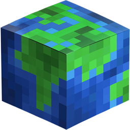

<h1><a href="#spanishAnchor">Español</a></h1>
<h1><a href="#englishAnchor">English</a></h1>
 
 
<h1>Español</h1>
<h1>MC-CoordHelper | Versión 0.9-Alfa</h1>

  ¿Cansado de apuntar tus coordenadas en un bloc de notas?  
  ¿Harto de complicados métodos para compartir las coordenadas con tus amigos en tus servidores?  
  MC-CoordHelper está aquí, tranquilos.

<h3>Cómo se empieza</h3>

  Empezar en MC-CoordHelper es muy sencillo, descarga la última versión a través de <a href="https://drive.google.com/file/d/0B-RHqixhE4jLb3lhNWItN3BZSnc/view">éste enlace</a>, extráelo usando Winrar, un programa gratuíto que puedes obtener a través del <a   href="https://www.winrar.es/descargas">siguiente enlace</a> y haz doble clic en el ejectable de su interior.
   
  Al abrirse el programa podrás ver un menú con tres opciones.  
  - La primera, mundos, te llevará a la pantalla de login.  
  - La segunda, ajustes, te llevará a los ajustes de la aplicación, donde podrás cambiar el idioma y otros parámetros que vayan añadiéndose a la aplicación.  
  - La tercera, ayuda, te llevará a la ayuda del programa, aún sin realizar.  
  
   
  Cuando estés en la pantalla de login, da en el botón de "Regístrate" para crear un usuario y contraseña, una vez creado, haz login, crea tu mundo y empieza a guardar tus coordenadas. Si quieres invitar a algún amigo, simplemente utiliza el botoncito con la llave inglesa, es todo muy intuitivo.
   
  Si saliese una nueva versión de la aplicación, ésta te avisará y no se abrirá, podrás descargar la última versión del mismo enlace que descargaste la primera.

<h3>Atajos de Teclado</h3>

  - Ctrl+Shift+O: Abre la ventana de coordenadas si estuviese ya abierta, o en su defecto la lista de mundos.  
  - Ctrl+Shift+C: Cierra todas las ventanas de información de coordenadas si las hubiera.  

  ### Funcionalidades
- [x] Anotar tus coordenadas se ha vuelto infinitamente más sencillo  
- [x] Crear mundos  
- [x] Crear grupos de coordenadas en cada mundo  
- [x] Crear coordenadas en cada grupo de mundo  
- [x] Editar y borrar todo lo anterior  
- [x] Ventana de información de coordenada superpuesta al resto de ventanas para tenerla siempre visible   
- [x] Invitar a otros usuarios al mundo  
- [x] Cambiar el idioma de la aplicación  
- [x] Auto-detectar el idioma al primer arranque de la aplicación  
- [x] Recordar posición de la aplicación y al abrirse colocarse donde estaba anteriormente  
- [ ] Aparición automática de cambios en el mundo por otros usuarios  
- [ ] Información en la lista de mundos de quién creó el mundo para diferenciarlo de los tuyos  
- [ ] Aparición en el pop-up de invitaciones pendientes de quién te ha invitado  
- [ ] Creación de la sección "ayuda"  
- [ ] Creación de un formulario para notificar errores de forma más cómoda  
- [ ] Creación de un auto-actualizador de la aplicación  
- [ ] Auto-adaptar el alto de la ventana de coordenadas al alto del monitor  
- [ ] Atajo de teclado para realizar una búsqueda rápida de alguna coordenada  

 
 
Para cualquier duda, aporte, fallo, o pregunta escribid a hzaragoza.developer@gmail.com

 
 
 
<h1>English</h1>
<h1>MC-CoordHelper | Version 0.9-Alfa</h1>

  Tired of pointing your coordinates in a notebook?  
  Tired of complicated methods to share the coordinates with your friends on your servers?  
  MC-CoordHelper is here, dont't worry.

<h3>Getting started</h3>

  
Start at MC-CoordHelper is very simple, download the latest version through <a href="https://drive.google.com/file/d/0B-RHqixhE4jLb3lhNWItN3BZSnc/view"> this link </a>, extract it using Winrar, a free program that you can obtain through the <a href="https://www.winrar.es/descargas"> next link </a> and double click on the ejecta inside.
   
When you open the program you will see a menu with three options.  
  - The first, worlds, will take you to the login screen.  
  - The second, settings, will take you to the settings of the application, where you can change the language and other parameters that will be added to the application.  
  - The third one, help, will take you to the help of the program, still not done.  
  
   
When you are in the login screen, click on the "Register" button to create a username and password, once created, login, create your world and start saving your coordinates. If you want to invite a friend, simply use the little button with the spanner, it's all very intuitive.
   
  If a new version of the application comes out, it will notify you and it will not open, you can download the latest version of the same link that you downloaded the first one.
</ p>
<h3> Keyboard Shortcuts </h3>

  - Ctrl+Shift+O: Open the window of coordinates if it were already open, or the list of worlds if not.  
  - Ctrl+Shift+C: Close all the coordinates information windows if there are any.  

  ### Funtionalities
- [x] Writing down your coordinates has become infinitely easier  
- [x] Create worlds  
- [x] Create coordinate groups in each world  
- [x] Create coordinates in each world group  
- [x] Edit and delete all of the above  
- [x] Coordinate information window superimposed on the rest of the windows to have it always visible  
- [x] Invite other users to the world  
- [x] Change the language of the application  
- [x] Auto-detect the language at the first start of the application  
- [x] Remember the position of the application and when it opens, position itself where it was before  
- [ ] Automatic appearance of changes in the world by other users  
- [ ] Information in the list of worlds of who created the world to differentiate it from yours  
- [ ] Appearance in the pop-up of pending invitations from who invited you  
- [ ] Creation of the "help" section  
- [ ] Creation of a form to notify errors more conveniently  
- [ ] Creation of an application auto-updater  
- [ ] Auto-adapt the height of the coordinate window to the height of the monitor  
- [ ] Keyboard shortcut to perform a quick search of some coordinate  

 
 
For any questions, input, failure, or question write to hzaragoza.developer@gmail.com

